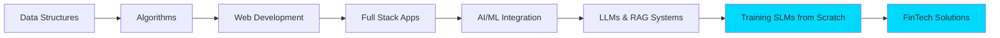

<div align="center">
  
</div>

<div align="center">
  
[](https://geektech1717.blogspot.com/)
[](https://www.linkedin.com/in/mayank-mewar-586090173/)
[](https://github.com/mayank171)

</div>

---

## 🚀 About Me

I'm a **passionate Software Developer and AI Enthusiast** from Delhi, India, specializing in building intelligent, data-driven applications. I combine full-stack development expertise with cutting-edge AI/ML technologies to create impactful solutions in finance, education, and deep learning research.

```python
class Mayank:
    def __init__(self):
        self.role = "Full Stack Developer & AI Engineer"
        self.location = "Delhi, India"
        self.education = "Student"
        self.interests = ["AI/ML", "FinTech", "Language Models", "Web Development"]
        self.currently_working_on = ["Training SLMs from Scratch", "RAG Systems", "Portfolio Analytics"]
        
    def say_hi(self):
        print("Thanks for dropping by! Let's build something amazing together!")

me = Mayank()
me.say_hi()
```

- 🔭 **Currently Building:** Small Language Models (SLMs) from scratch & AI-Powered Investment Platform
- 🌱 **Deep Diving Into:** Transformer Architecture, Tokenization, RAG Systems, Financial Modeling
- 💬 **Ask me about:** LLMs/SLMs, Full Stack Development, AI/ML, Data Structures, Algorithms
- 📝 **I write on:** [GeekTech Blog](https://geektech1717.blogspot.com/)
- ⚡ **Fun fact:** The world's first programmer was Ada Lovelace in the 1840s!

---

## 💼 Featured Projects

### 🧠 [Small Language Model (SLM) from Scratch](https://github.com/mayank171/SLM)
> **Building and Training Language Models from First Principles** | Educational Deep Dive

An in-depth educational project that demystifies how Large Language Models work by building a Small Language Model from scratch using pure Python and PyTorch.

**🎯 What Makes This Special:**
- **Alien Analogy Explanation** - Unique pedagogical approach explaining LLMs as if you don't know human language
- **Complete Pipeline** - From tokenization to training, every step explained
- **Hands-on Implementation** - Jupyter notebook with working code
- **Deep Theoretical Insights** - Covers BPE tokenization, autoregressive generation, self-supervised learning

**📚 Key Concepts Covered:**
- **Tokenization Deep Dive**
  - Word-based vs Character-based vs Subword (BPE) - with pros/cons
  - Why modern LLMs use Byte Pair Encoding (BPE)
  - Building a tokenizer from scratch
  
- **Architecture Fundamentals**
  - Context windows and batch processing
  - Creating input-output pairs from raw text
  - Why LLMs are "autoregressive" and "self-supervised"
  - Emergent abilities and scaling laws
  
- **Training Pipeline**
  - Dataset: TinyStories (simplified language corpus)
  - Memory-mapped binary files for efficient training
  - Train/validation split methodology
  - Multiple prediction tasks per sequence

**🔬 Technical Highlights:**
- Implements GPT-2 tokenizer using `tiktoken`
- Efficient data loading with numpy memory mapping
- Sliding window approach for sequence generation
- Batch processing with context window = 4, demonstrating 16 simultaneous predictions

**📊 What You'll Learn:**
- How LLMs learn grammar, semantics, and world knowledge from next-token prediction
- Why model size matters (parameters from 2 to 175 billion+)
- Difference between LLMs (general purpose) and SLMs (domain-specific)
- Real GPT-3 scaling laws and emergent abilities graphs

**🛠️ Tech Stack:**
`Python` `PyTorch` `NumPy` `Tiktoken` `Transformers` `Jupyter Notebook`

**🎓 Perfect For:**
- Understanding transformer architectures from the ground up
- Learning about tokenization strategies
- Grasping the fundamentals before diving into advanced LLM research
- Building domain-specific small language models

---

### 🤖 [AI-Powered Portfolio Manager](https://github.com/mayank171/portfolio-manager)
> **Full-Stack Investment Analysis Platform** | [](https://portfolio-manager-v0.streamlit.app)

A cutting-edge full-stack investment platform that revolutionizes portfolio management with AI and advanced financial modeling.

**🎯 Key Features:**
- **Multi-Asset Portfolio Tracking** - Mutual funds, NPS, equities, gold, and silver
- **Monte Carlo Simulations** - Advanced forecasting with 10,000+ scenario runs for portfolio values and risk
- **LLM-Powered RAG System** - Personalized investment insights and diversification recommendations
- **Real-Time Analytics** - Live market data integration and performance tracking
- **Risk Modeling** - Comprehensive VaR, CVaR, and diversification analysis

**🛠️ Tech Stack:**
`Python` `Streamlit` `LangChain` `OpenAI` `Pandas` `NumPy` `Plotly` `Financial APIs`

**📊 Impact:**
- Integrated Monte Carlo simulations modeling risk-return scenarios
- Built RAG system for context-aware investment advice
- Automated portfolio rebalancing suggestions based on diversification analysis

---

### 🎓 [Placement Cell Management System](https://github.com/mayank171/Placement-Cell-Management-System)
> **Enterprise-Grade Campus Placement Platform** | ⭐ 13 Stars | 🍴 11 Forks

A comprehensive web application that streamlines campus placement operations for educational institutions.

**Key Features:**
- Student authentication and profile management
- Job opportunity tracking and applications
- Interview scheduling and result management
- Academic performance integration
- Recruiter dashboard with analytics

**Tech Stack:** `Python` `Flask` `SQL` `HTML/CSS` `JavaScript` `Bootstrap`

**Impact:** Successfully deployed for managing 100+ student placements

---

### 💻 [LeetCode & GeeksforGeeks Solutions](https://github.com/mayank171/leetcode)
> **Competitive Programming Solutions Repository** | 500+ Problems Solved

A curated collection of optimized solutions demonstrating strong algorithmic thinking.

**Highlights:**
- 500+ problems across data structures and algorithms
- Detailed time/space complexity analysis
- Well-commented C++ implementations
- Topics: Arrays, Trees, Graphs, DP, Greedy, Backtracking

**Tech Stack:** `C++` `Data Structures` `Algorithms`

---

### 📚 [Data Structure Programs](https://github.com/mayank171/Data-Structure-Programs)
> **Comprehensive DSA Implementation Library**

Educational resource featuring fundamental data structures and algorithms with detailed explanations.

**Contents:**
- Linear structures (Arrays, Linked Lists, Stacks, Queues)
- Trees (Binary, BST, AVL, Heaps)
- Graph algorithms (DFS, BFS, Dijkstra, Kruskal)
- Sorting & Searching algorithms
- Blog tutorials for each implementation

**Tech Stack:** `C++` `Data Structures` `Algorithms`

---

## 🛠️ Tech Stack & Skills

### 💻 Programming Languages
<p>


</p>

### 🤖 AI/ML & Deep Learning
<p>


</p>

### 🌐 Web Development
<p>


</p>

### 🗄️ Databases & Tools
<p>


</p>

---

## 📊 GitHub Analytics

<div align="center">
  
  
</div>

<div align="center">
  
</div>

<div align="center">
  
</div>

---

## 📈 Contribution Graph

<div align="center">
  
</div>

---

## 🎯 Core Competencies

<table>
  <tr>
    <td align="center" width="25%">
      
      <br><strong>LLM/SLM Engineering</strong>
      <br><sub>Training from Scratch</sub>
    </td>
    <td align="center" width="25%">
      
      <br><strong>Full Stack Dev</strong>
      <br><sub>Python, Flask, React</sub>
    </td>
    <td align="center" width="25%">
      
      <br><strong>Algorithms & DSA</strong>
      <br><sub>500+ Problems Solved</sub>
    </td>
    <td align="center" width="25%">
      
      <br><strong>FinTech Solutions</strong>
      <br><sub>Trading, Analytics</sub>
    </td>
  </tr>
</table>

---

## 📝 Latest Blog Posts

<!-- BLOG-POST-LIST:START -->
I regularly write about technology, programming, and problem-solving on my blog [GeekTech](https://geektech1717.blogspot.com/). Topics include:

- 🧠 **Data Structures & Algorithms** - Deep dives into complex topics
- 🌐 **Web Development** - Modern frameworks and best practices
- 🏆 **Competitive Programming** - Tips, tricks, and problem walkthroughs
- 🤖 **AI/ML Tutorials** - Practical implementations and explanations
- 💡 **Language Models** - Understanding transformers and tokenization
- 💼 **Technical Interviews** - Preparation strategies and resources

<!-- BLOG-POST-LIST:END -->

---

## 🎓 Learning Journey



**Current Focus Areas:**
- 🔬 Training Small Language Models (SLMs) from scratch
- 🧠 Deep dive into transformer architecture and attention mechanisms
- 📊 Advanced financial modeling and Monte Carlo simulations
- 🤖 RAG systems for domain-specific applications
- 📈 Algorithmic trading strategies

---

## 🏆 Achievements & Stats

<div align="center">

| 🎯 Metric | 📊 Count |
|-----------|----------|
| **LeetCode Problems** | 500+ |
| **GitHub Repos** | 11 |
| **Total Stars** | 15+ |
| **Blog Articles** | 50+ |
| **Followers** | 15 |
| **SLM Tutorial Views** | Growing! |

</div>

- 🧠 **SLM from Scratch** - Complete educational guide on language models
- 🦈 **Pull Shark** - Active open-source contributor
- ⭐ **Portfolio Manager** - Live production app with AI/RAG integration
- 🎓 **Placement Cell** - 13 stars, actively forked and used
- 📝 **Tech Blogger** - Sharing knowledge with the community

---

## 💡 What I'm Working On

```python
current_projects = {
    "primary": [
        "Training Small Language Models from scratch",
        "AI-Powered Portfolio Manager with RAG"
    ],
    "learning": [
        "Transformer Architecture Deep Dive",
        "Advanced Tokenization (BPE, WordPiece)",
        "Financial Time Series Analysis"
    ],
    "side_projects": [
        "Algorithmic Trading Bot",
        "Custom Tokenizer Implementation",
        "Domain-specific SLM Training"
    ],
    "contributing": [
        "Open Source ML Tools",
        "Educational AI Resources"
    ]
}

for category, projects in current_projects.items():
    print(f"🚀 {category.upper()}:")
    for project in projects:
        print(f"   → {project}")
```

---

## 🤝 Let's Connect!

<div align="center">

I'm always excited to collaborate on innovative projects, especially in **AI/ML**, **Language Models**, **FinTech**, and **Full Stack Development**. Feel free to reach out!

[](https://www.linkedin.com/in/mayank-mewar-586090173/)
[](https://www.facebook.com/mayank.mewar.3/)
[](https://geektech1717.blogspot.com/)
[](mailto:your.email@example.com)

</div>

---

## 💭 Random Dev Quote

<div align="center">
  
</div>

---

## 🎮 When I'm Not Coding

- 📚 Reading about LLM research papers and financial markets
- 🧩 Solving competitive programming challenges
- ✍️ Writing technical articles on my blog
- 🎯 Exploring new AI/ML architectures
- 🌐 Contributing to open-source ML projects
- 🧠 Building intuition about transformer models

---

<div align="center">

### 💙 Thanks for visiting! Let's build the future together!


**Show some ❤️ by starring my repositories!**

[](https://github.com/mayank171)

</div>
